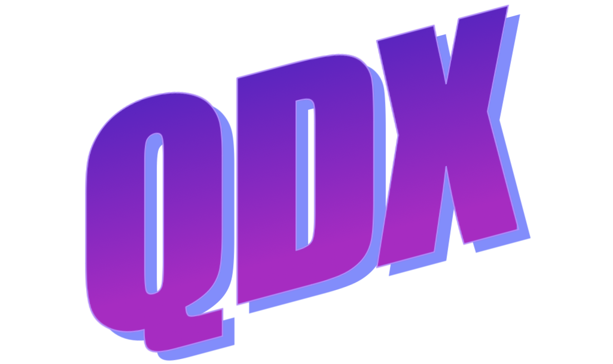

<table>
  <tr>
    <td>
      
    </td>
    <td>
      <h1>QEC AI-discovery with JAX ⚛️🤖🚀</h1>
    </td>
  </tr>
</table>


[](https://arxiv.org/abs/2311.04750)  <a href="https://colab.research.google.com/drive/1nU9Xivfms_wXrJmv0F6uFz4_DOWoryhg?usp=sharing" target="_blank"></a> 

Code repository for the paper "Simultaneous Discovery of Quantum Error Correction Codes and Encoders with a Noise-Aware Reinforcement Learning Agent" by *Jan Olle, Remmy Zen, Matteo Puviani and Florian Marquardt*.

## Description
This library can be used to train Reinforcement Learning (RL) agents to codiscover quantum error correction (QEC) codes and their encoding circuits *from scratch, without any additional domain knowledge* except how many errors are not detected given the quantum circuit it has built.

The RL agent can be made *noise-aware*, meaning that it learns to produce encoding strategies simultaneously for a range of noise models, making it applicable in very broad situations. 


The whole RL algorithm, including the Clifford simulations of the quantum circuits, are implemented in Jax. This enables parallelized training of multiple agents on vectorized environments in a single GPU. Our implementation builds upon [PureJaxRL](https://github.com/luchris429/purejaxrl?tab=readme-ov-file).

## Installation

QDX can be installed by:

1. Cloning the repository

``` bash
git clone https://github.com/jolle-ag/qdx.git
cd qdx
```

2. Installing requirements
``` bash
pip install -r requirements.txt
```

### GPU compatibility:

To install [JAX with NVIDIA GPU support](https://jax.readthedocs.io/en/latest/index.html) (**Note: wheels only available on linux**), use:

```
# CUDA 12 installation
pip install --upgrade "jax[cuda12_pip]" -f https://storage.googleapis.com/jax-releases/jax_cuda_releases.html

# CUDA 11 installation
pip install --upgrade "jax[cuda11_pip]" -f https://storage.googleapis.com/jax-releases/jax_cuda_releases.html
```


## Usage Example

We include a [demo](https://github.com/jolle-ag/qdx/blob/main/notebooks/demo.ipynb) jupyter notebook for two different situations: [[7,1,3]] code discovery in a fixed symmetric depolarizing noise channel and noise-aware [[6,1]] code discovery in a biased noise channel.

 <a href="https://colab.research.google.com/drive/1nU9Xivfms_wXrJmv0F6uFz4_DOWoryhg?usp=sharing" target="_blank"></a> 

 ## License

The code in this repository is released under the MIT License.

## Citation
``` bib
@article{olle_simultaneous_2023,
  title={Simultaneous Discovery of Quantum Error Correction Codes and Encoders with a Noise-Aware Reinforcement Learning Agent},
  author={Olle, Jan and Zen, Remmy and Puviani, Matteo and Marquardt, Florian},
  url = {http://arxiv.org/abs/2311.04750},
  journal={arXiv preprint arXiv:2311.04750},
  urldate = {2024-04-01},
  publisher = {arXiv},
  month = nov,
  year = {2023},
  note = {arXiv:2311.04750 [quant-ph]},
}
```